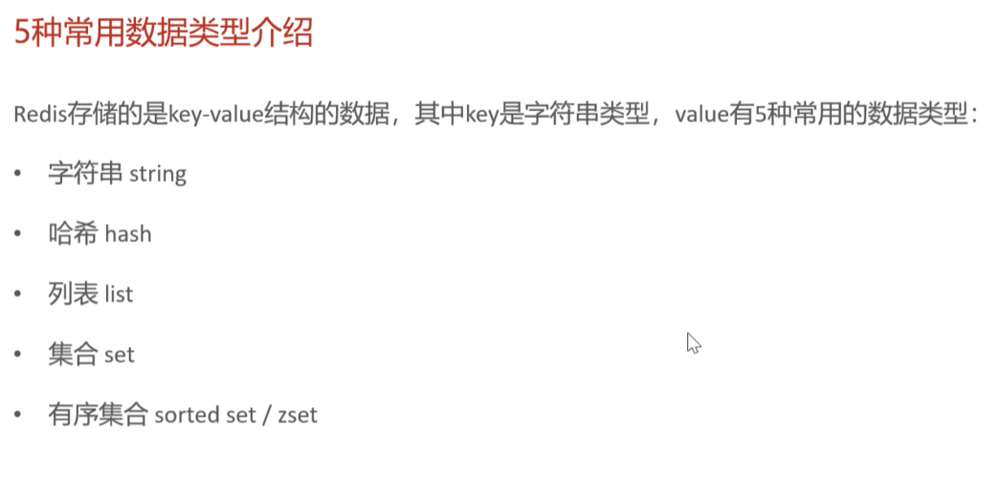
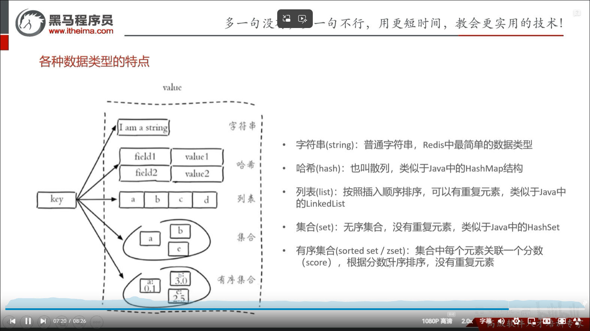
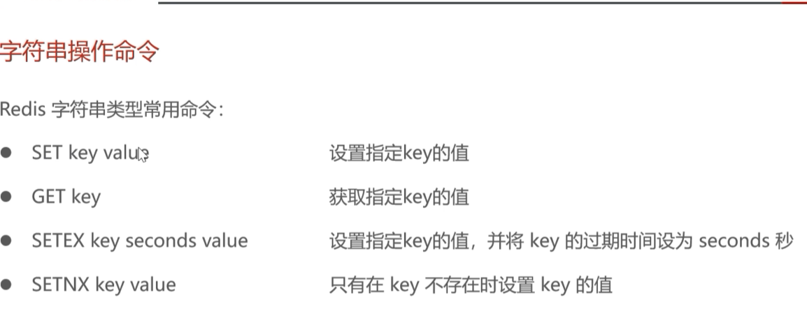
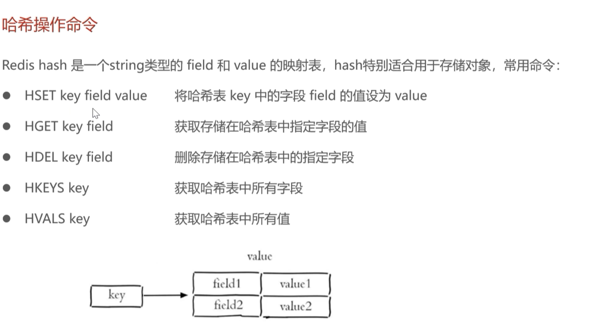
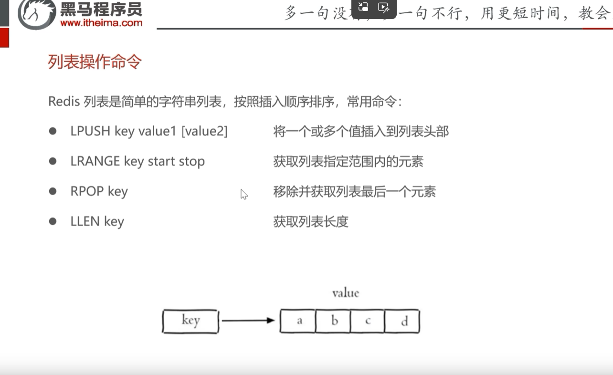
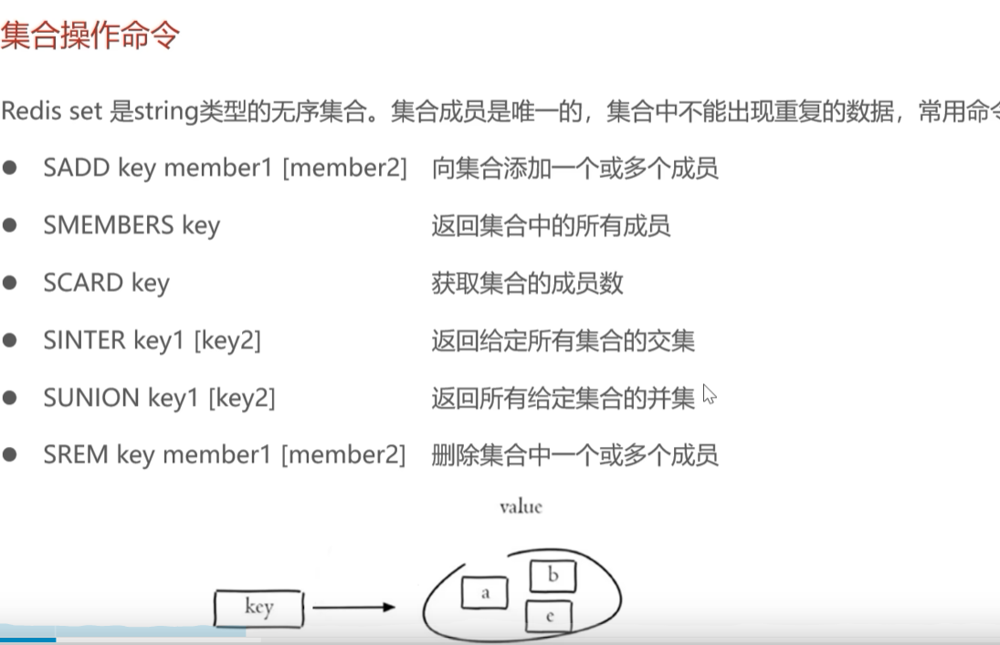
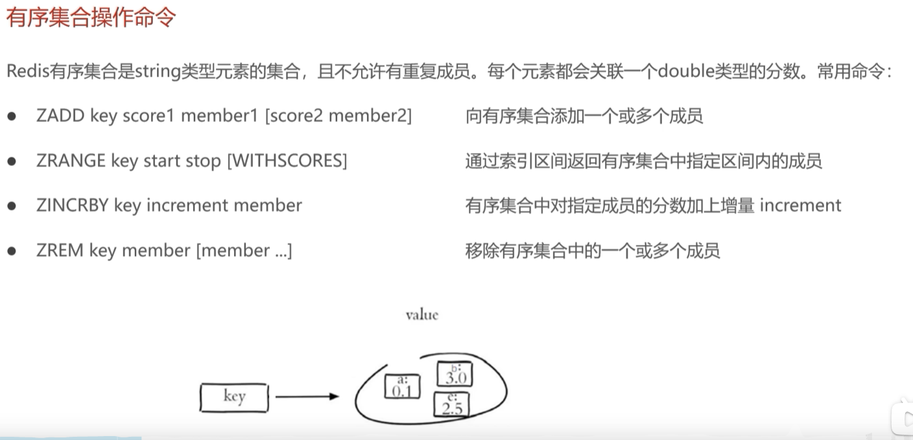
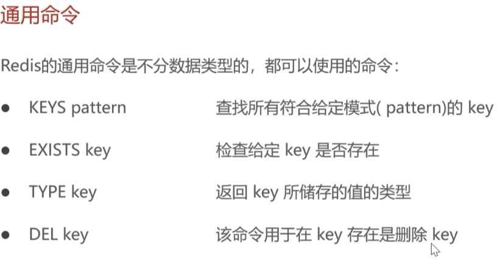

## redis邪修

- 为什么用redis？
  redis是基于java写的，java是在内存里面，内存的读写速率远远大于硬盘，所以用redis
- redis本质
  本质是一个map<string,Object>这样的数据结构
- redis使用
  比如有模块A和模块B，实际上redis是一个公共存储，模块A和模块B里面用连接(http)去访问数据

## redis常用数据类型

### 类型特点

