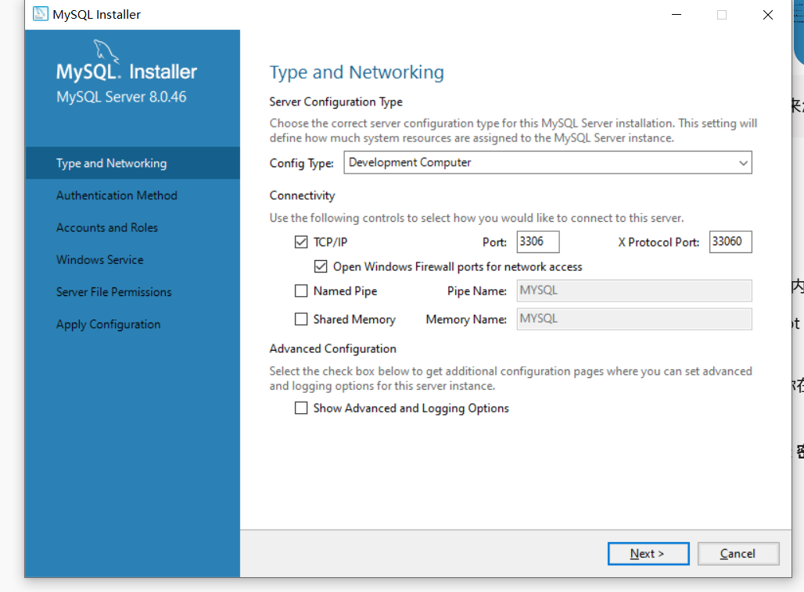

# mysql和navicat需要注意版本号吗
在使用 Navicat 连接和管理 MySQL 时，基本不需要太担心版本兼容问题，因为 Navicat 作为通用的数据库客户端，向下兼容能力非常强大。

# 安装mysql
- 直接下载8的版本
- 安装mysql的时候注意设置密码，记住密码，后面连接数据库需要用到
- 如果之前中断过installer.msi，mysql可能已经安装过了，那要接着用这个msi工具先去remove一下
- 安装配置
  - Server only（推荐）： 仅安装 MySQL 数据库服务端本体。因为你后续会使用 Navicat 作为可视化客户端，并在 Spring Boot/IDEA 里写代码连接，所以本机的系统环境只需要提供数据库服务即可，这样安装最干净、占内存最小。
  - 配置
    - 
    - mysql root password :mysql123456
- 

# 安装可视化navicat prime 17
- navicat怎么找到对应的mysql，是服务启动之后自动就连上去吗
  - 需要创建连接，然后要记得安装mysql的端口号
- 创建navicat账号
  - 姓名：真实姓名
  - 邮箱：qq邮箱
  - 密码：Navicat.666666

