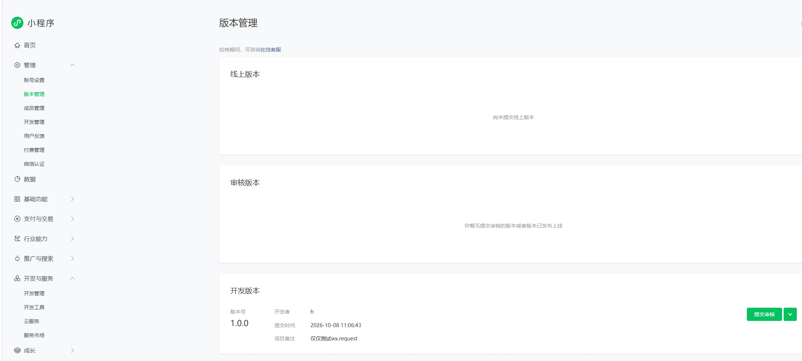
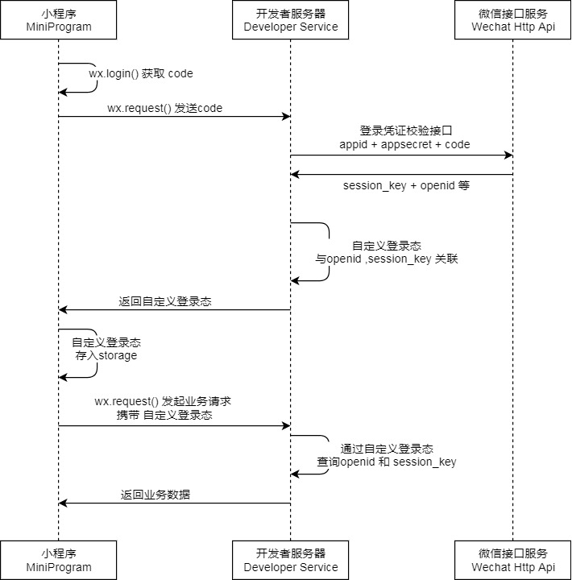
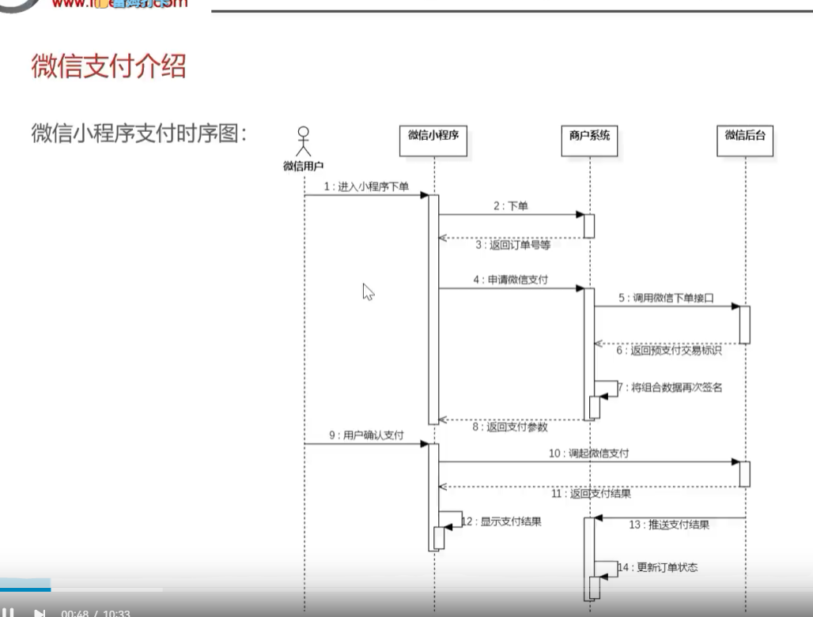

- 注册邮箱
  - 账号 13155978236@163.com
  - 密码 网易(full)符号尾号四位
- 小程序账号密码
  - 账号 13155978236@163.com
  - 密码 微信(full)符号尾号四位
  - 
  - 小程序信息
    - 类型：个人
    - 类目：其他（非游戏）
    - 身份证：本人
    - 姓名：本人
    - 手机号：副卡流量卡
    - 管理员微信：本人大号
- 小程序发布流程
  - 总的步骤
  - 完善基础信息
    - 第一步填写信息
    - 第二步补充小程序类目
    - 第三步添加开发者（省略因为只有一个人开发）
  - 代码开发与调试
    
    ①下载工具：下载微信开发者工具进行代码的开发和上传下载
    ②创建或导入项目：前往微信开发者工具创建小程序项目或导入使用其他工具开发的小程序项目查看教程
    ③预览与真机体验：在工具上完成编译预览、真机调试与体验查看教程
    ④上传代码：在工具上上传小程序代码查看教程
  - 备案与认证
    - 备案 
    - 认证

## 等待继续的链接

https://mp.weixin.qq.com/wxamp/home/guide?lang=zh_CN&token=1317726817

## 小程序的appId和appSecret

存储在微信收藏里面

## 编写完成提交代码之后去哪里看

微信小程序管理 版本管理


## 小程序登陆

https://developers.weixin.qq.com/miniprogram/dev/framework/open-ability/login.html
文档位置：微信官方文档：小程序=>开放能力=>用户信息=>小程序登录


### 具体后台流程

前置知识 [jwt知识](./JWT-Token学习笔记.md)
前置知识 [常量绑定](./yaml里面的常量绑定.md)

1. 配置文件yaml
   1. 配置jwt的字段
   2. 配置appId和secret（来自小程序官方）
2. 设计DTO和VO
   - DTO
     - 只需要code(前端wx.login生成)
   - VO字段
     - openid
     - session_key
     - id
     - token
3. wx.login接口具体功能拆分
   1. controller层
      1. 调用wxLogin方法获取user对象(包含id和openId)
      2. 调用jwt工具类生成token，返回userLoginVO(包含id、openId和token)
         `ps:这里面的id是本地后端服务生成的和openId关联在本地一张user表里面的，openId是wx.login()生成的`
   2. service层：
      1. 先和微信客户端沟通获取openId
         1. 获取前端wx.login生成的code
         2. 获根据code调用httpclient去获取请求(code2Session)的结果
      2. 查用户，如果是第一次注册的，就去插入这个openId的user表数据
      3. 最后返回查到的user对象

```返回类型
    UserLoginDTO   // 前端传进来：{ "code": "xxx" }
    User           // 数据库里的用户实体 service层
    UserLoginVO    // 后端返回给前端：{ id, openid, token }
```

### 小程序支付

- 时序图
