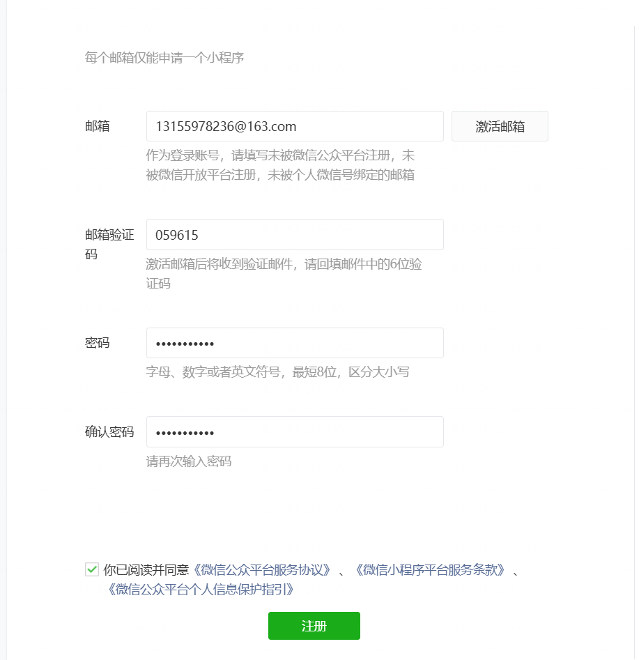
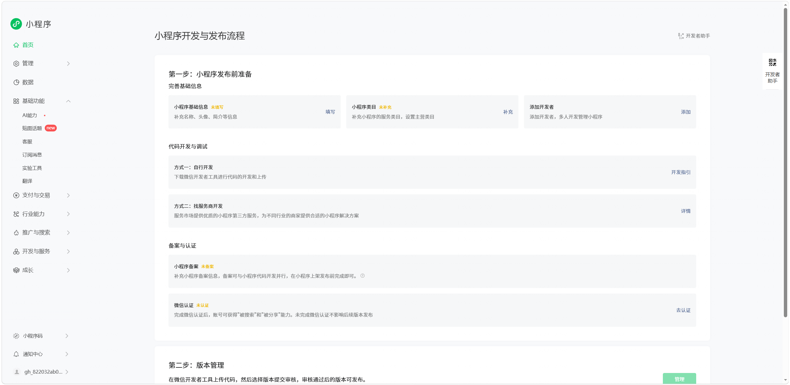
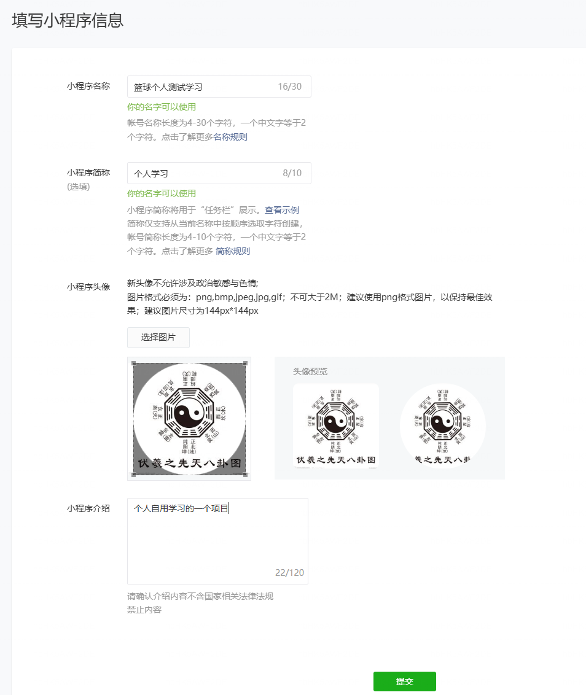
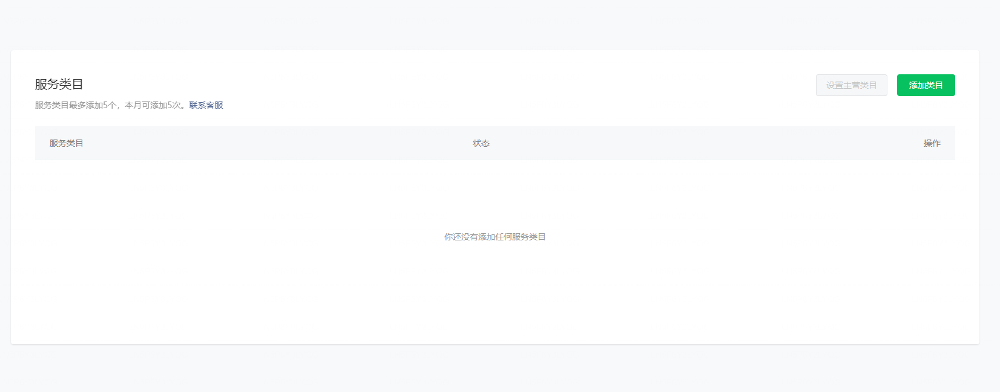
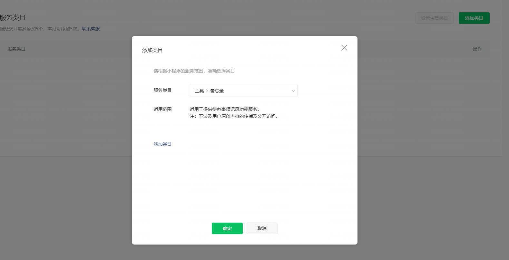
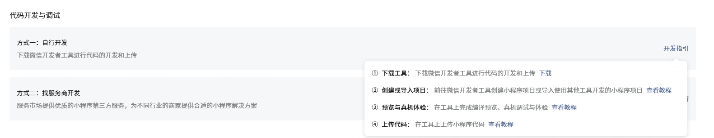
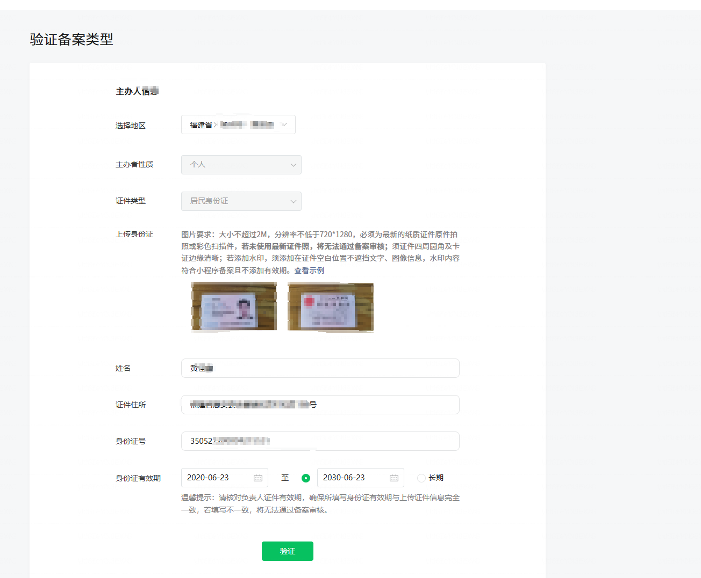
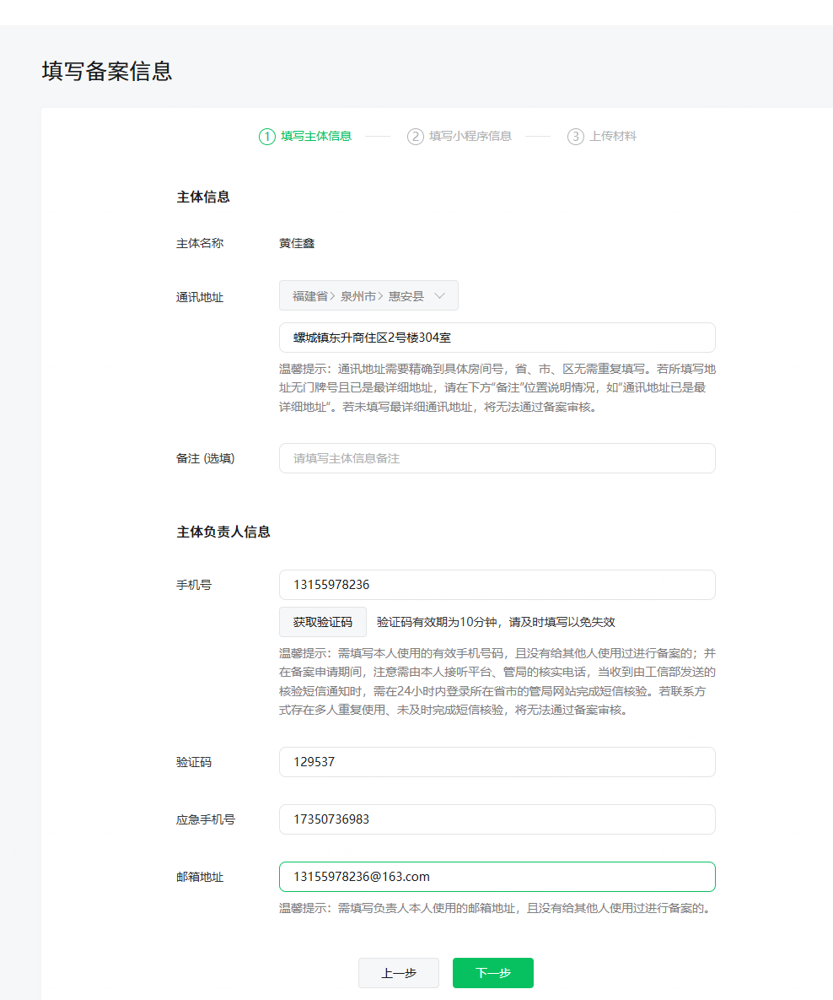
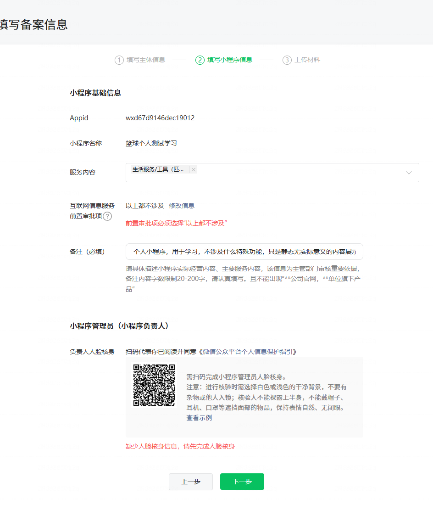
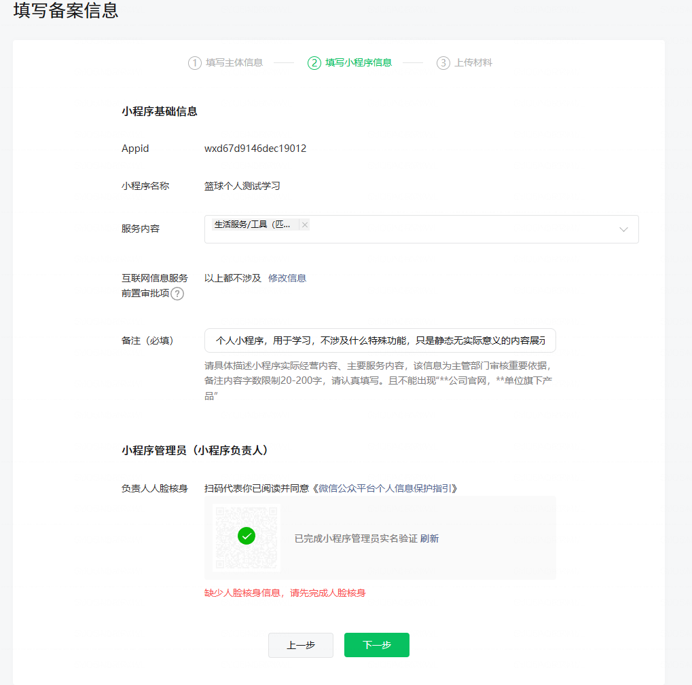

- 注册邮箱
  - 账号 13155978236@163.com
  - 密码 网易(full)符号尾号四位
- 小程序账号密码
  - 账号 13155978236@163.com
  - 密码 微信(full)符号尾号四位
  - 
  - 小程序信息
    - 类型：个人
    - 类目：其他（非游戏）
    - 身份证：本人
    - 姓名：本人
    - 手机号：副卡流量卡
    - 管理员微信：本人大号
- 小程序发布流程
  - 总的步骤
  - 完善基础信息
    - 第一步填写信息
    - 第二步补充小程序类目
    - 第三步添加开发者（省略因为只有一个人开发）
  - 代码开发与调试
    
    ①下载工具：下载微信开发者工具进行代码的开发和上传下载
    ②创建或导入项目：前往微信开发者工具创建小程序项目或导入使用其他工具开发的小程序项目查看教程
    ③预览与真机体验：在工具上完成编译预览、真机调试与体验查看教程
    ④上传代码：在工具上上传小程序代码查看教程
  - 备案与认证
    - 备案 
    - 认证

## 等待继续的链接

https://mp.weixin.qq.com/wxamp/home/guide?lang=zh_CN&token=1317726817

## 小程序的appId和appSecret

存储在微信收藏里面
