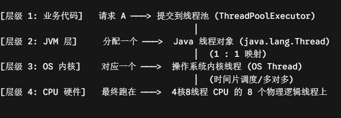
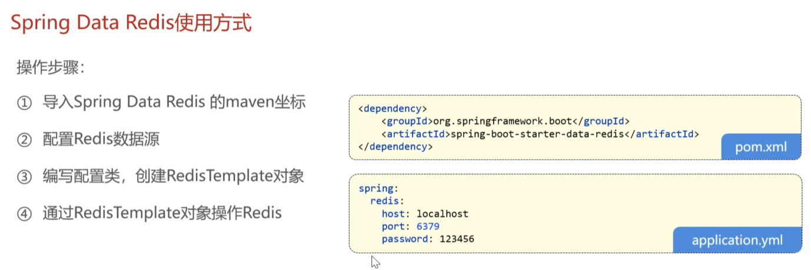
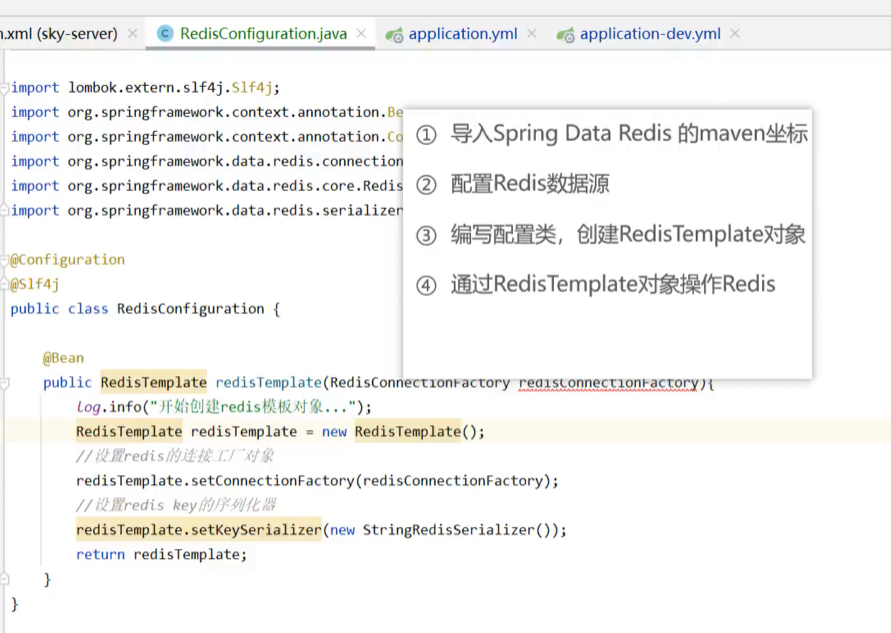
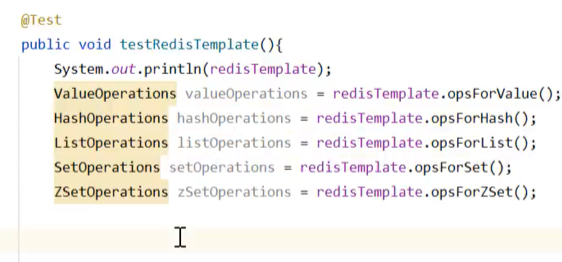
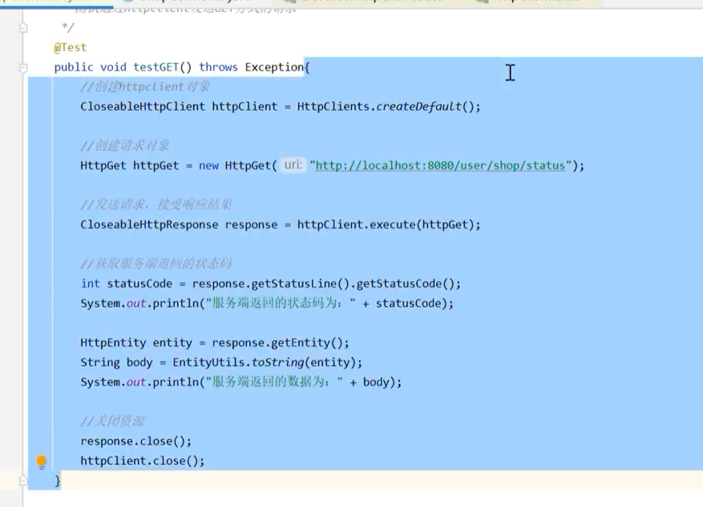
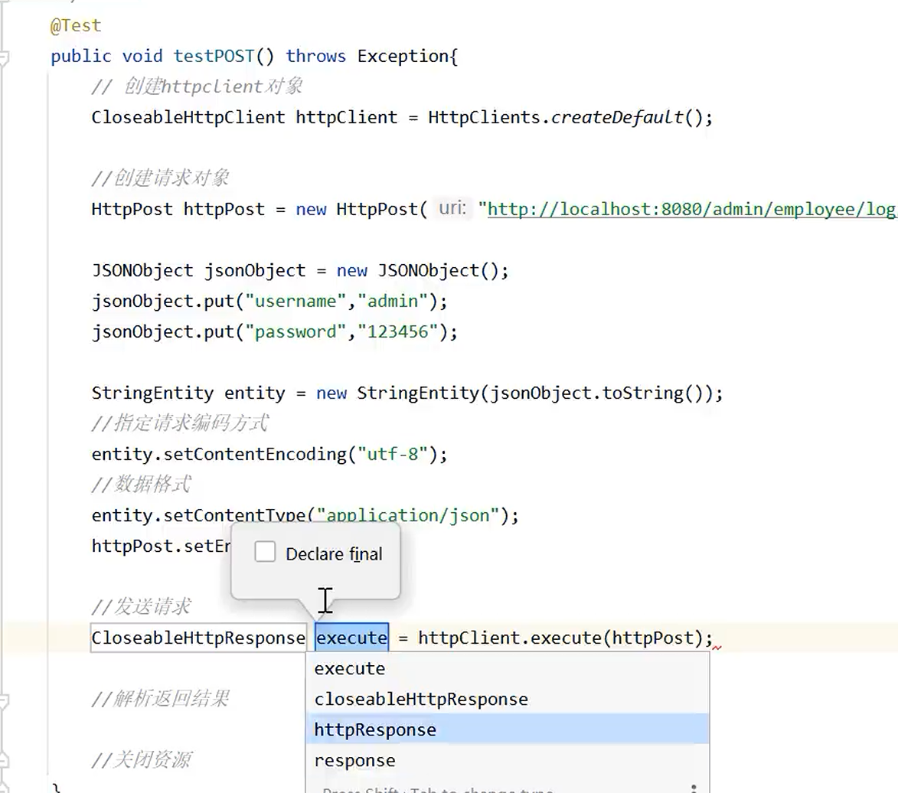
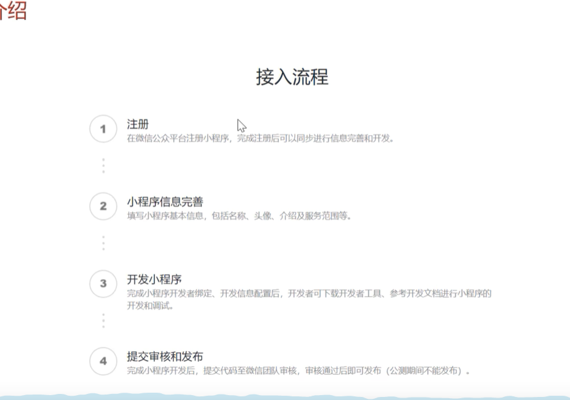
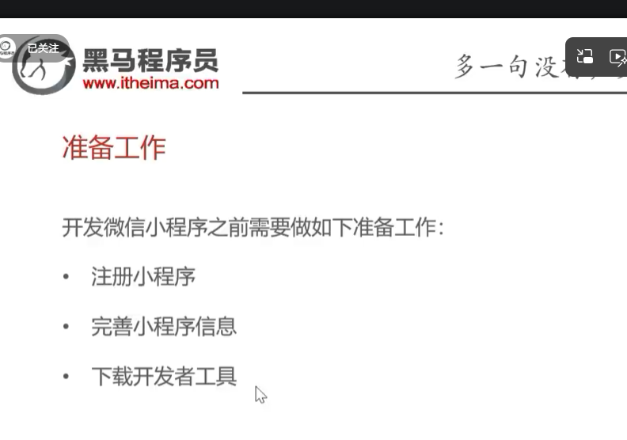

# 苍穹外卖

### java里面线程和进程的关系

- 
- 操作系统的java进程 > JVM 线程(ThreadLocal（线程的私人抽屉）)

### Result.success写在哪里？

写在controller层里面

### 数据拦截转换

```java
package com.sky.config;

/**
 * 配置类，注册web层相关组件
 */
@Configuration
@Slf4j
public class WebMvcConfiguration extends WebMvcConfigurationSupport {
    // .....一些省略了的代码
    protected void extendMessageConverters(List<HttpMessageConverter<?>> converters){
        log.info("开始扩展消息转换器");

        //创建一个消息转化器对象
        MappingJackson2HttpMessageConverter converter = new MappingJackson2HttpMessageConverter();
        //设置对象转换器，可以将java对象转为字符串
        converter.setObjectMapper(new JacksonObjectMapper());

        //将我们自己的转换器放入spring MVC的框架容器中；
        converters.add(0,converter);
    }
}

```

### 功能：启用禁用员工账号

### 切面编程+注解

- 目的：给每个增加或者更新的操作固定的把create_user/create_time/update_user/update_time自动更新上去
- 伪代码实现

### 阿里云oss

1. 先配置 @configrationPropertie

   ```java
    package com.sky.properties;

    import lombok.Data;
    import org.springframework.boot.context.properties.ConfigurationProperties;
    import org.springframework.stereotype.Component;

    @Component
    @ConfigurationProperties(prefix = "sky.alioss")
    @Data
    public class AliOssProperties {

        private String endpoint;
        private String accessKeyId;
        private String accessKeySecret;
        private String bucketName;

    }
   ```

2. 然后在配置application的yml文件的时候就有补全提示了

### springboot请求分层

1. Controller 层（控制层）—— 像餐厅的“前台服务员”
   - 它的工作：负责接待顾客（接收前端发来的 HTTP 请求），把顾客点的东西（参数）记录下来，然后转达给后厨（调用 Service）。最后，把后厨做好的菜（处理结果）打包成固定的餐盒（Result 对象）端给顾客。
   - 核心职责：
     - 接收前端传来的 JSON 数据或路径参数（@RequestBody, @PathVariable 等）。
     - 调用 Service 层的方法。
     - 绝对不能写任何复杂的业务逻辑（比如计算价格、判断状态等）。
     - 绝对不能直接去操作数据库（调用 Mapper）。
     - 负责返回统一格式的响应给前端（return Result.success()）。
2. Service 层（业务层）—— 像餐厅的“后厨大厨”
   - 它的工作：它是整个系统最核心的大脑。大厨拿到前台传来的菜单（DTO），决定先切菜、再热油、最后翻炒（调用多个 Mapper，做逻辑判断、参数转换）。做完后，把菜炒好。
   - 核心职责：
     - 写所有的业务逻辑（比如：判断密码对不对、计算订单总金额、判断菜品状态）。
     - 接收前台传的数据（通常是 DTO），转换成数据库能接受的格式（Entity）。
     - 调用 Mapper 层去操作数据库。
     - 控制事务（@Transactional），比如“插入菜品”和“插入口味”必须同时成功或失败。
       如果做菜失败（比如食材不够/数据不存在），在这里直接抛出异常（throw new RuntimeException）。
3. Mapper 层（数据持久层）—— 像餐厅的“食材搬运工”
   - 它的工作：它只懂 SQL，不懂业务。大厨告诉它：“去仓库给我拿 3 个土豆”（执行 SQL），它就去仓库（数据库）把数据捞出来交给大厨。
   - 核心职责：
     - 只负责写 SQL 语句（定义在 XML 里，或者用注解写在 Java 接口里）。
     - 只负责和数据库打交道，做最底层的增（insert）、删（delete）、改（update）、查（select）。
     - 返回原始的数据库结果（比如受影响行数 int，或者查出来的实体对象 Dish）

### @RequestParam 自动解包

- 场景：
  ```text
  DELETE /dish?ids=1,2,3
  ```
  前端传过来的是一个逗号分隔的字符串 "1,2,3"，但后端需要的是一个 List<Long> 来执行批量删除。
- 不用 @RequestParam 的写法（手动转换）

  ```java
    @DeleteMapping("/dish")
    public Result delete(@RequestParam String ids) {
        // ids = "1,2,3"
        // 手动 split 再转换
        List<Long> idList = Arrays.stream(ids.split(","))
                .map(Long::parseLong)
                .collect(Collectors.toList());

        dishService.deleteBatch(idList);
        return Result.success();
    }
  ```

- 用 @RequestParam 的自动转换
  ```java
  @DeleteMapping("/dish")
  public Result delete(@RequestParam List<Long> ids) {
      // Spring 自动把 "1,2,3" 转成 [1L, 2L, 3L]
      dishService.deleteBatch(ids);
      return Result.success();
  }
  ```
- 做了什么
  | 步骤 | 说明 |
  | ----------- | ------------------------------------------ |
  | 前端传参 | `ids=1,2,3`（字符串） |
  | Spring 接收 | `@RequestParam List<Long> ids` |
  | 内部处理 | Spring 自动按逗号 split，再逐个转成 `Long` |
  | 最终结果 | `ids` = `[1L, 2L, 3L]`（`List<Long>`） |
  Spring 内部用的是 ConversionService，它知道怎么把 "1,2,3" 这种逗号分隔的字符串转成 List\<Long\>、List\<Integer\>、List\<String\> 等集合类型。
- 注意点

1. 参数名必须匹配：前端传的是 ids=1,2,3，后端参数名也要叫 ids（或者用 @RequestParam("ids") 显式指定）。
2. 类型要对应：如果前端传的是数字 ID，后端就用 List<Long>；如果传的是字符串，就用 List<String>。
3. GET 请求用 @RequestParam，POST 请求用 @RequestBody：苍穹外卖的批量删除用的是 DELETE 请求 + 查询参数，所以用 @RequestParam。如果是 POST + JSON body，那就用 @RequestBody List<Long> ids。
4. 不是所有类型都能自动转：Spring 内置了对基本类型和常见类型的转换支持。如果是自定义对象，需要自己写 Converter。

### java自动写super方法

```java
  package com.sky.exception;

  /**
   * 业务异常
   */
  public class BaseException extends RuntimeException {

      public BaseException() {
      }

      public BaseException(String msg) {
          super(msg);
      }

  }

```

这里面的无参构造方法会自动调用super

### content-type类型有很多，我要怎么去掌握它

实际上开发只需要掌握3种核心的：

1. application/json
   - 特征：前端发来的是 JSON 字符串（比如 {"name": "小明", "age": 20}）。
   - 后端怎么接：使用 @RequestBody 注解接收。
   - 典型场景：Vue/React 等前端框架发请求、前后端分离的 POST/PUT 请求
2. application/x-www-form-urlencoded
   - 特征：数据格式像 GET 请求一样拼接，比如 name=小明&age=20。
   - 后端怎么接：不需要任何注解，Spring MVC 会自动把参数绑定到方法里的 POJO（实体类/DTO）上。
   - 典型场景：网页原生 HTML 表单提交（不带 /<input type="file"//> 的普通表单）、登录页面。
3. multipart/form-data
   - 特征：用于上传文件，请求体里不仅有文本，还有二进制文件流。
   - 后端怎么接：使用 @RequestParam 接收文件，或者用实体类接收。
   - 典型场景：上传图片、上传视频、带文件的复杂表单提交。

- [相关详解链接](./Spring_Boot_请求参数接收与Content-Type_终极指南.md)

### 我现在有个Long类型的id，怎么手动包装成list，比如(List)这样可以吗？

不可以，List和Long不是继承关系，可以用其他手段比如Arrays.asList()方法来包装

### redis使用-docker版本

1. 先创建对应的宿主机目录

```bash
C:\docker\redis\data
C:\docker\redis\conf
```

2. config文件夹下面默认生成一个文件 redis.conf

```
bind 0.0.0.0
protected-mode no
port 6379
requirepass 123456
appendonly yes
```

3. docker命令启动redis容器

```bash
docker run -d --name redis -p 6379:6379 --restart=always -v C:/docker/redis/conf/redis.conf:/usr/local/etc/redis/redis.conf -v C:/docker/redis/data:/data redis redis-server /usr/local/etc/redis/redis.conf
```

4. 命令行敲击docker ps，如果看到redis是up的状态就是正在运行

### redis配合springboot使用



1. 添加maven
   ```
    <dependency>
        <groupId>org.springframework.boot</groupId>
        <artifactId>spring-boot-starter-data-redis</artifactId>
    </dependency>
   ```
2. 配置yml文件
3. 
4. 编写测试类开始测试（代码对应五种数据类型）
   

### 使用httpclient




### 小程序




[小程序的操作](./小程序相关.md)
