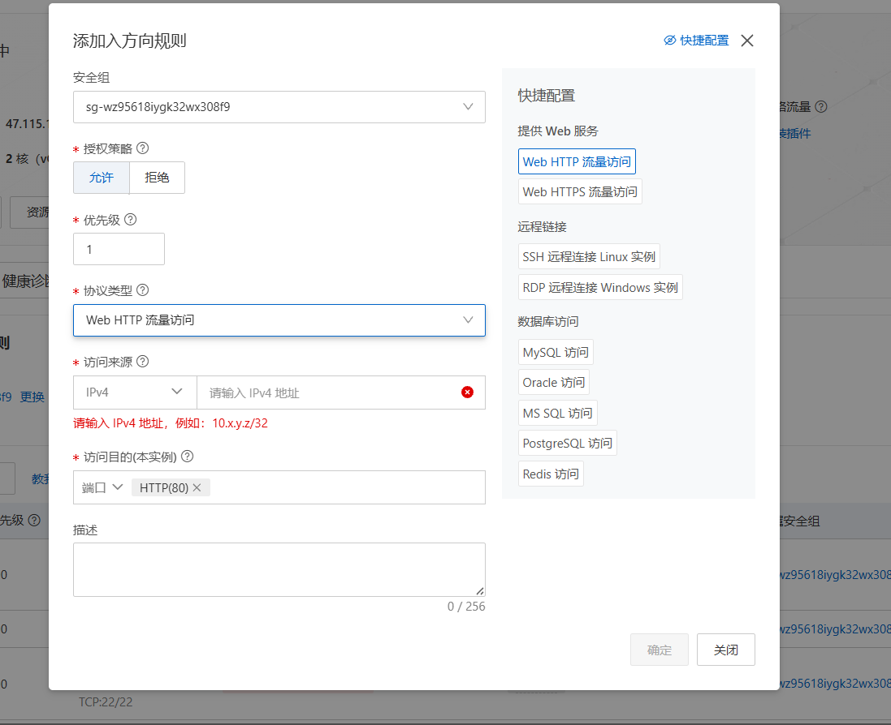
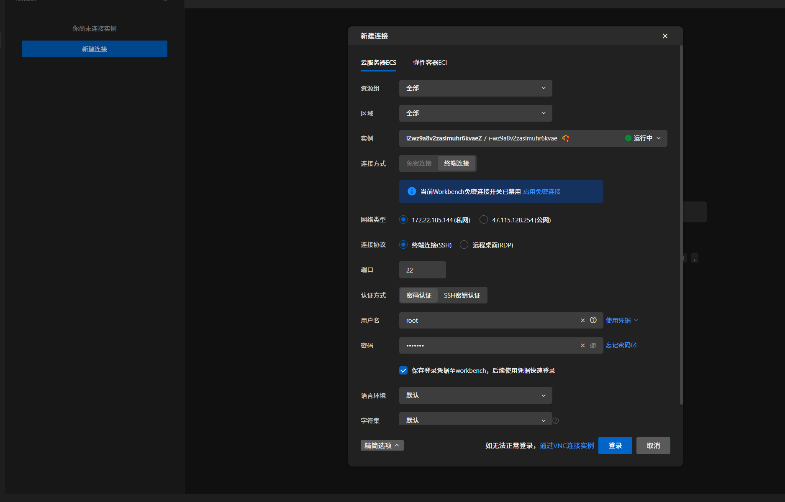
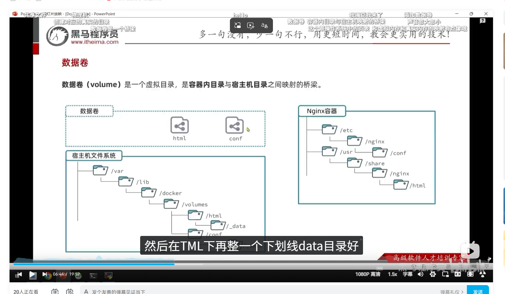
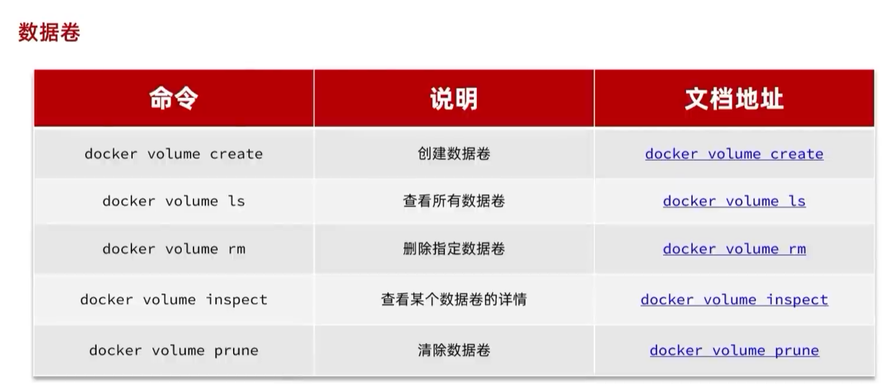

# docker

## docker镜像组成
软件+配置+运行环境

## 隔离容器的作用
如果一台服务器有很多资源，比如几百G的内存，跑一个程序浪费，跑多个程序环境又不一样，所以为了解决这个，就隔离了容器跑多个服务

## docker命令作用
拿这个跑mysql的举例子
```bash
docker run -d \
--name mysql \
-p 3306:3306 \
-e MYSQL_ROOT_PASSWORD=123 \
mysql:5.7
```
- docker run 表示创建一个容器
- -d 表示让容器一直在后台运行 detached model=>分离模式运行，不会占用当前终端
- --name 表示给容器起名字
- -p 3306:3306 左边的 3306（宿主机端口）：指你运行 Docker 的那台物理机器（比如你的 Windows 电脑、Mac，或者云服务器）;右边的 3306（容器端口）：指 Docker 容器内部，MySQL 数据库服务默认监听的端口。宿主机端口映射到容器接口
- e 环境变量key和value，在docker hub（类似npm市场）里面的文档看得到
- mysql:5.7 表示使用mysql的5.7版本的镜像，如果本地没有就会去docker hub下载

## 连接远程的linux
```bash
     ssh root@47.115.128.254
    密码Root123
```

## 连接远程的linux的mysql
1. 远程服务器先暴露端口 
2. 起服务，记得如果要改端口的话，注意下面的-p和--port，一个是连接 宿主机和容器 管道映射，一个是管理程序在容器里面的端口位置
3. 使用navicat连接，注意使用公网ip


## 在docker上面下载mysql
```bash
mkdir -p /opt/mysql/data /opt/mysql/conf

docker run -d \
  --name mysql \
  -p 3306:3306 \
  -v /opt/mysql/data:/var/lib/mysql \
  -v /opt/mysql/conf:/etc/mysql/conf.d \
  -e MYSQL_ROOT_PASSWORD=mysql123 \
  --restart=always \
  mysql:8.0
```


- 如果要使用远程系统里面的mysql命令行，用docker启动的话要
```
docker exec -it mysql-teach mysql -uroot -pmysql123
```
- 如果要远程使用开发主机连接远程linux服务器上的docker的mysql
- 如果要把mysql启动在3307,要在port后面加上--port=3307
  ```bash
    docker run -d \
    --name mysql-teach \
    -p 3307:3307 \
    -v /opt/mysql/data:/var/lib/mysql \
    -v /opt/mysql/conf:/etc/mysql/conf.d \
    -e MYSQL_ROOT_PASSWORD=mysql123 \
    --restart=always \
    mysql:8.0 --port=3307
  ```
  Q:`-p 3307:3307和--port=3307是什么区别?`
  A:`-p 是 Docker 用的：负责把服务器外面的端口“映射/转接”进容器内部。
    --port= 是 MySQL 软件用的：负责修改 MySQL 软件自己监听的端口号`
  


## 云服务器
- 要设置公网连接

## linux下docker的文件管理
- 为什么用数据卷？
  `比如我们安装了一个nginx，我们是没有办法在容器里面使用命令行的文件系统的，因为容器环境只有nginx运行的依赖，就是说没有`
- 数据卷
例如给nginx的容器文件创建一个，会在真实的linux宿主机创建文件，只是位置看着不一样
绑定之后，容器内的文件系统(例如nginx容器内的)会和宿主机的文件系统同步（铁索连环）

- 数据卷操作指令
 
- 创建容器的时候绑定数据通道
  - 使用docker的创建容器的命令时候加一个-v
  - -v 的基本语法结构为：-v 宿主机路径 : 容器内路径
- 怎么查看远程linux宿主机内部的存储
  `cd`
- nginx一般创建的时候有三个数据卷
  ```bash
  docker run -d \
  --name nginx \
  -p 80:80 \
  -v /opt/nginx/html:/usr/share/nginx/html \
  -v /opt/nginx/conf/nginx.conf:/etc/nginx/nginx.conf \
  -v /opt/nginx/logs:/var/log/nginx \
  --restart=always \
  nginx:alpine 
  ```
  

## nginx跨域
浏览器和springboot端口存在跨域
nginx和springboot端口不会跨域（服务器和服务器之间不会跨域）
所以 浏览器<=>nginx<=>springboot就不会跨域
Nginx 替浏览器扛下了“跨域”的身份，把原本的“跨域请求”变成了“同源请求”。

这种逻辑可以用三个角色来精炼概括：浏览器 $\Leftrightarrow$ Nginx：走的是 80 同源端口，满足浏览器的同源策略，直接放行。Nginx $\Leftrightarrow$ Spring Boot：走的是 服务器内部通信（TCP/内部 HTTP），不受浏览器同源策略限制。整体链路：浏览器根本不知道后端 Spring Boot 的存在，它以为所有的接口和静态网页都是 Nginx 一个人提供的。

## 使用linux远程服务器+docker+nginx部署前后端项目
1. 创建nginx容器
   1. 先提前创建好文件夹
    ```bash
    mkdir -p /opt/nginx/html /opt/nginx/conf /opt/nginx/logs
    ```
   2. 在文件夹同级目录下先创建nginx.conf文件，避免等下docker执行命令的时候创建成文件夹出错
   3. 写nginx配置。[模版和介绍](nginx配置.md)
